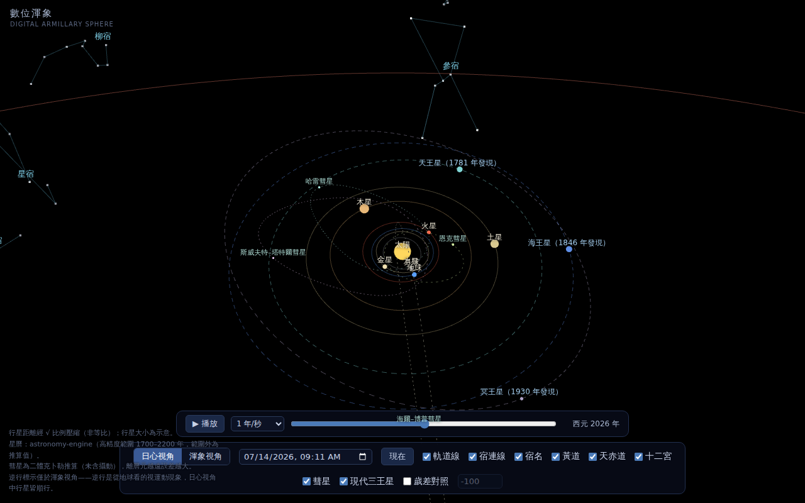
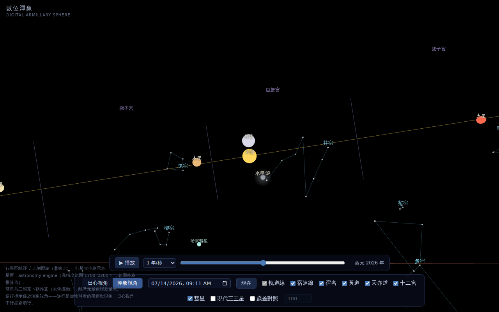
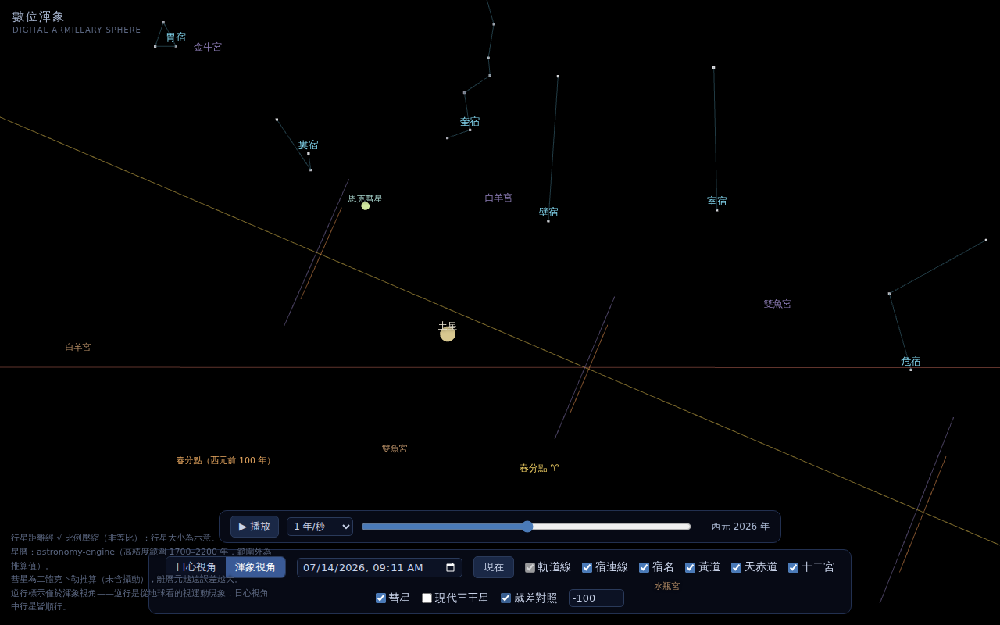
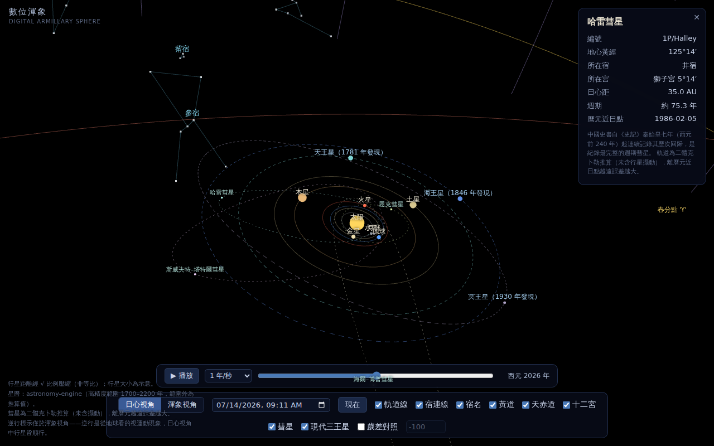

# Digital Armillary Sphere (數位渾象)

An interactive 3D web application that recreates the ancient Chinese armillary
sphere in the browser — bridging classical East Asian astronomy with modern
computational precision.

> Live demo: **[armillary.xianqiao.org](https://armillary.xianqiao.org)**

## Screenshots

| Heliocentric view | Geocentric view (渾象 mode) |
|---|---|
|  |  |

| Precession across millennia | Halley's Comet |
|---|---|
|  |  |

## Features

- **Heliocentric 3D star map** — planets with true orbital inclinations,
  positions computed from real ephemeris (VSOP87 via astronomy-engine)
- **Geocentric view (渾象 mode)** — the sky as ancient observers saw it:
  the 28 lunar mansions (二十八宿), zodiac divisions, ecliptic and
  celestial equator
- **Deep time** — a time axis from 1000 BC to AD 5000 with axial precession,
  showing the sidereal mansions drifting against the tropical zodiac
- **Precession comparison rings** — overlay the zodiac divisions of any two
  epochs (default: 100 BC vs. today) and see, per mansion, which sign its
  determinative star occupied in each era
- **Three determinative-star systems (距星三系統)** — Han (Shi Shi), late-Ming
  (Chongzhen calendar reform) and Qing (Yixiang Kaocheng) mansion-boundary
  conventions, with an overlay comparing where each era drew the boundaries.
  Verified against the Han-dynasty measured mansion widths recorded in the
  *Book of Han* (《漢書·律曆志》): the Qing determinative stars reproduce the
  Han measurements (mean error 0.49 gudu) — the Qing "re-assignment" was in
  fact a restoration of the Han-era stars, while the "-1" star numbering
  fossilizes the late-Ming convention (`npm run verify:distars`)
- **Retrograde motion indicators** — speed-adaptive glow and labels in the
  geocentric view (retrograde motion is a geocentric phenomenon, so the
  heliocentric view stays clean)
- **Comets** — Halley, Encke, Swift–Tuttle and Hale–Bopp on full Keplerian
  orbits; watch Halley's 2061 return
- **Modern planets, honestly labeled** — Uranus, Neptune and Pluto are
  visually distinct, annotated with discovery years, and fade out when the
  simulated date precedes their discovery

## Tech Stack

Vite · TypeScript · Three.js · astronomy-engine

## Why

The armillary sphere (渾象) was one of ancient China's most sophisticated
astronomical instruments. This project asks: what would Zhang Heng have built
with WebGL? By making precession and historical sky states tangible, it serves
both as an educational tool and a lens into how ancient civilizations read the
heavens.

## Development

```bash
npm install
npm run dev            # dev server at http://localhost:5173
npm run build          # static build to dist/
npm run preview        # preview the build
npm run verify:stage1  # ephemeris check: Jupiter's ecliptic longitude
npm run verify:stage2  # comet propagation & frame-transform checks
npm run verify:distars # determinative-star systems vs Han-dynasty measured widths
npm run gen:stars      # regenerate star data (see script for inputs)
```

Architecture notes ([ARCHITECTURE.md](ARCHITECTURE.md)) and the development
log ([PROGRESS.md](PROGRESS.md)) are written in Traditional Chinese.

## Data Sources & Accuracy

- **Ephemeris**: [astronomy-engine](https://github.com/cosinekitty/astronomy)
  (VSOP87-based, includes precession) — the single source of all positional
  computation. High-accuracy range is 1700–2200; outside it, values are
  extrapolations (noted in the UI).
- **Star positions / magnitudes / HIP numbers**:
  [HYG Database v4.1](https://github.com/astronexus/HYG-Database)
  (Hipparcos-derived, J2000, CC BY-SA 4.0).
- **Chinese star names**: [Stellarium](https://github.com/Stellarium/stellarium)
  Chinese sky culture (Yi Shitong system), converted to Traditional Chinese.
- **Determinative stars (距星)**: the Qing-dynasty *Yixiang Kaocheng*
  (儀象考成) system. Note the historical exceptions: 奎宿 → ζ And,
  觜宿 → φ¹ Ori, 參宿 → δ Ori.
- **Comets**: JPL Small-Body Database osculating elements, two-body Keplerian
  propagation (no planetary perturbations — error grows away from each epoch;
  noted in the UI).
- Stellar proper motion is ignored in this version (stars fixed at J2000);
  planetary distances are √-compressed for legibility (not to scale).

## Deployment

`npm run build` produces a fully static `dist/` with relative paths
(`base: './'`) — upload to any static host (the live site runs on a Hostinger
subdomain with zero server-side configuration).

## Roadmap

- **Bilingual UI** — Traditional Chinese / English
- **Mobile interaction refinements** — touch-friendly controls and a more
  compact layout for small screens
- **Stellar proper motion** — free the stars from J2000
- **Ecliptic-locked geocentric mode** — keep the zodiac band level while
  panning
- **CI auto-deploy** — push-to-publish via GitHub Actions

## Acknowledgments

This project was built in close collaboration with **Claude Fable 5**
(Anthropic), working through [Claude Code](https://claude.com/claude-code) —
architecture design, implementation, browser-driven verification and
documentation were developed in an AI pair-programming workflow, with project
direction, review and deployment by Justin Lee. Commits carry
`Co-Authored-By` trailers recording the collaboration.

## License

Code is released under the [MIT License](LICENSE).

Star catalog data is derived from the Hipparcos catalog (via HYG Database
v4.1, CC BY-SA 4.0); Chinese star names follow the Stellarium Chinese sky
culture. The 28 lunar mansion determinative stars follow the Qing-dynasty
*Yixiang Kaocheng* (儀象考成) system as standardized in modern historical
astronomy research.
